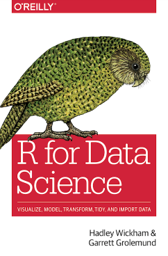
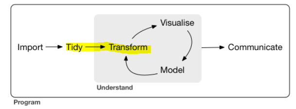
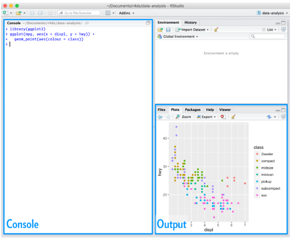

**Note:**

-An R Notebook is an R Markdown document with chunks that can be executed independently and interactively, with output visible immediately beneath the input.

-Notebook output are available as HTML, PDF, Word, or Latex. 

-This Notebook as HTML is preferably open with Google Chrome.

-R-Code can be extracted as Rmd file under the button "Code" in the notebook.

-This Notebook using iterative development. It means the process starts with a simple implementation of a small set of idea requirements and iteratively enhances the evolving versions until the complete version is implemented and perfect.


#Welcome



This book are:

* Teach you how to do data science with R
* How to get your data into R
* Get the data into the most useful structure, transform it, visualise it and model it
* A practicum of skills for data science
* How to clean data and draw plots
* Learn how to use the grammar of graphics
* Literate programming: an explanation of the program logic in a natural language, such as English
* Reproducible research: the results can be reproduced if given access to the original data, software, or code
*  How to manage cognitive resources to facilitate discoveries when wrangling, visualising, and exploring data

**Key Points of this boooks: **

Data science is an exciting discipline that allows you to turn raw data into understanding, insight, and knowledge.

* What you will learn

    * Import:  stored in a file, database, or web API, and load it into a data frame in R
    * Tidy:  each column is a variable, and each row is an observation
    * Transform: calculation column or measures, aggregation, or decoding the data into another meaning, creating new variables, summary statistics (tidying and transforming are called wrangling)
    * Visualisation:  A good visualisation will show you things that you did not expect, or raise new questions about the data
    * Models: a fundamentally mathematical or computational tool
    * Communication: The last step of data science
    
Surrounding all these tools is programming

      


* How this book is organised

    * Start with visualisation and transformation of data that’s already been imported and tidied (EDA)
    * Some topics are best explained with other tools (visualisation, tidy data, and programming)
    
* What you won’t learn: this book can’t cover every important topic

* Big data

    * 1-2 Gb of data for `data.frame` or tidy data
    * 10-100 Gb for `data.table`
    * More than 100 Gb, we need a system (like Hadoop or Spark) that allows you to send different datasets to different computers for processing (parallel programming)
    
* Python, Julia, and friends: we won’t learn anything about Python, Julia, or any other programming language useful for data science
* Non-rectangular data: this book focuses exclusively on rectangular data, not including images, sounds, trees, and text (Non-rectangular data) 
* Hypothesis confirmation: It’s possible to divide data analysis into two camps: hypothesis generation and hypothesis confirmation. The key difference is how often do you look at each observation: if you look only once, it’s confirmation; if you look more than once, it’s exploration
* Prerequisites: some programming experiences with R. There are four things you need to run the code in this book: R, RStudio, a collection of R packages called the tidyverse, and a handful of other packages
* R: To download R, go to CRAN, the comprehensive R archive network. https://cloud.r-project.org/
* RStudio: RStudio is an integrated development environment, or IDE, for R programming




* The tidyverse: an R package is a collection of functions, data, and documentation that extends the capabilities of base R. The majority of the packages that you will learn in this book are part of the so-called tidyverse.

`install.packages("tidyverse")`
`library(tidyverse)`

* Other packages: In this book we’ll use three data packages from outside the tidyverse

`install.packages(c("nycflights13", "gapminder", "Lahman"))`

These packages provide data on airline flights, world development, and baseball that we’ll use to illustrate key data science ideas.

* Running R code: Code in the book looks like this

```{r}
1 + 2
```

Throughout the book we use a consistent set of conventions to refer to code:

_ Functions are in a code font and followed by parentheses, like `sum()`, or `mean()`

_ Other R objects (like data or function arguments) are in a code font, without parentheses, like `flights` or `x`

_ If we want to make it clear what package an object comes from, we’ll use the package name followed by two colons, like `dplyr::mutate()`, or `nycflights13::flights`

* Getting help and learning more

_ Google

_ Stackoverflow

Three things you need to include to make your example reproducible:

_ Packages should be loaded at the top of the script

_ The easiest way to include data in a question is to use dput() to generate the R code to recreate it

_ Ensuring that your code is easy to read


#Introduction


#Change log update

* 30.04.2019
* 


#Preferences

* [R for Data Science](https://r4ds.had.co.nz/)


#License

[MIT](https://opensource.org/licenses/MIT)
